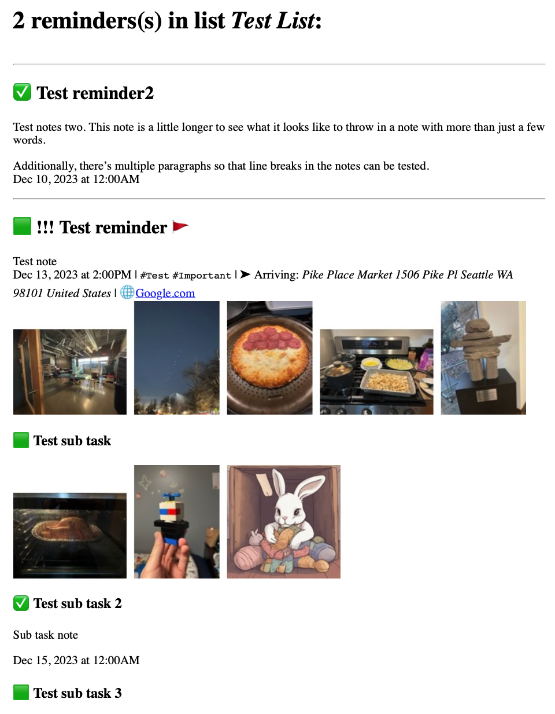

# SiriShortcuts

## 1. ChatGPT

### A. [I have a question](https://www.icloud.com/shortcuts/e01b052c382d44e09631dd5ba4a22e2d) 🔗

* Starts a voice-only conversation with ChatGPT using the ChatGPT iOS/iPadOS app (does not work on macOS)
* Using the ChatGPT app has the following advantages
  * A paid ChatGPT Plus account is optional, but you'll need at least a free ChatGPT account
  * If you do have a ChatGPT Plus subscription, you can optionally use GPT4 as the model
  * ChatGPT will remember previous messages as you continue your conversation
* You can specify initial and followup system prompts in order to better control ChatGPT's behavior (as well as setup "custom instructions" in the ChatGPT app)
* When run from lock screen, dictation of your prompt to ChatGPT will end automatically when a pause is detected
* When run while unlocked, dictation will continue until you press the stop button ⏹️
* Shortcut can be modified to use OpenAI or ElevenLabs TTS by replacing the "Speak Text" action with "Run Shortcut" pointing to (2A) or (2B) below

#### Known issues

* The Shortcut may complain that you are not logged into the ChatGPT app, even though you are
  * The workaround is to simply rerun the Shortcut, which will work on subsequent runs
  * Every Shortcut using the ChatGPT app may have this same issue
  * Please let me know if you find a reliable solution for this; I've tried including a very short use of the "Ask ChatGPT" action so that its later use will always succeed, but any failure of the action causes the Shortcut to fail, so this approach doesn't work

### B. [I want to have a conversation](https://www.icloud.com/shortcuts/bd154f690837417cb81ede56f71448dc) 🔗

* Similar to (1), but unlocks phone first in order to avoid some issues that happen on the lock screen (does not work on macOS)
* Uses OpenAI TTS to read back response in a more natural voice (needs "Speak text with OpenAI" (2A) shortcut installed)
* Can modify shortcut to use ElevenLabs TTS for reading back response if desired, or to use iOS built-in TTS

### C. [Weather summary](https://www.icloud.com/shortcuts/d844ac557277490cb8cf3d17abda5c8d) 🔗

* Fetches weather data for your current location and have ChatGPT read back a natural language summary of the upcoming weather
* Uses the ChatGPT app like (1), so does not work on macOS

### D. [Today's agenda and weather](https://www.icloud.com/shortcuts/37e039275d6f48cfa13d3acac46640b4) 🔗

* [Same but for weekly agenda](https://www.icloud.com/shortcuts/76e8d60616164b779ae70ebafbcfea2e) 🔗
* Define a list of iOS calendars and reminder lists which are used to fetch your scheduled events for the day, and have ChatGPT read back a summary of your agenda along with the weather
* Uses the ChatGPT app like (1), so does not work on macOS

### E. [ChatGPT via API](https://www.icloud.com/shortcuts/b25f4e45e68d4f02ae01a54cad2f59ea) 🔗

* Drop-in replacement for the ChatGPT app's "Ask ChatGPT" Shortcut action
* Provide text or a valid dictionary as input and use the OpenAI API to submit the text to ChatGPT as a prompt
  * Valid input dictionary contains optional keys “prompt”, “model”, “temperature”, and “apikey”
* If run with no input, the Shortcut will ask for text input
* Requires your own [OpenAI API key](https://help.openai.com/en/articles/4936850-where-do-i-find-my-api-key) 🔗
* This does not provide any back-and-forth conversation capability, and only provides a basic example of how to use the OpenAI API for interacting with ChatGPT
  * For back-and-forth conversation, you would need to give ChatGPT "memory" by including previous messages, both yours and ChatGPT's responses, in the `messages` array in the Dictionary that is passed to the "Get contents of URL" action.
  * This functionality would need to be added by you (please PR an improved shortcut if you make one ;) )
  * This method of "memory" will quickly increase the cost of using this shortcut, as the number of tokens in each API call will grow with each subsequent call
  * For this reason it is preferable, in my opinion, to use the ChatGPT app as in the above shortcuts so that OpenAI's own internal method of "memory" is used, which has none of these drawbacks

### F. [Create calendar events](https://routinehub.co/shortcut/17514/) 🔗

* Takes text (or an image/screenshot containing text), e.g. from an email client or Messages and uses ChatGPT to suggest one or more calendar events from the text content
* You can choose which identified events will be added, and edit details beforehand if necessary
* Messages and email clients suck at suggesting events; they're always incomplete and unhelpful and require additional user input. This lets ChatGPT improve the process by parsing out the necessary information automatically
* Automatically populates
  * an appropriate event title
  * start/end time and all day status
  * location
  * url
  * an appropriate calendar
  * attendee list
  * notes with references to relevant part(s) of the text used for creating the event

### G. [Add work shifts to calendar](https://www.icloud.com/shortcuts/543ac4dc519e4bf0979cc2e93138f8ba) 🔗

* Does your work send you your upcoming schedule in a text or email? (Those jerks...)
* This shortcut will take that message and create calendar events with them automatically
* Can be setup to run as an automation to be triggered by a text message/email, assuming the sending phone number or email address is consistent
* If the message/email is an amended schedule, this will check for conflicts with previously created shifts and delete the old ones
* Uses the "ChatGPT via API" shortcut (see E above) to make it more reliable, since it's meant to be run automatically. You can modify it easily to use the ChatGPT app instead.

## 2. Google Gemini Pro

### A. [Gemini via API](https://www.icloud.com/shortcuts/61be06430fa4496a8d8f70b337d07840) 🔗

* Drop-in replacement for the "Ask ChatGPT" shortcut action, or
* Runs standalone for text/image-based Gemini requests
* Logs conversations/images to Files App at `/Shortcuts/GeminiAPI`
* [View/continue Gemini conversation with this companion shortcut](https://www.icloud.com/shortcuts/16edafadcee248a0b0fa082037a8d199) 🔗
* Currently, Gemini-Pro API access is FREE for up to 60 queries per minute!

```
This shortcut is design to be run standalone or from other Shortcuts. It passes the input prompt to Google via their API and returns the response if successful.

Input: Text (a prompt, possibly via Share Sheet), 
OR 
a valid Dictionary with optional keys, 
“prompt”, “messages”, “image”, “model”, “temperature”, “apikey”, “repeat”, “speak”, "datetime", and "disablelogging"
OR 
nothing. If no prompt is provided, user will be asked to provide one before continuing. 

Output: A text string containing the bot response, OR an output dictionary containing “messages” and “output”. 

Setup:  Can set default model, API key and temperature.
```
```
Dictionary input arguments:
“model” a valid model name to use.
“temperature” a number between 0 and 
“messages” a JSON array passed as the “contents” to the API. You don’t have to build it manually, since it’spart of the output. Just maintain it between calls to the shortcut. (see https://ai.google.dev/tutorials/rest_quickstart#multi-turn_conversations_chat). 
“image” is a text string that is a base64-encoded image. 
“repeat” is 0 or 1 to control if this shortcut repeats automatically (ongoing conversation). 1 to repeat. 
“speak” is 0 or 1 to control if output is read aloud. 1 to speak. 

https://ai.google.dev/docs/concepts#model_parameters
https://ai.google.dev/tutorials/rest_quickstart#configuration

Dictionary output content:
When a dictionary is used as input, this shortcut will output a dictionary with “output” string and “messages” JSON array that can be passed back into the shortcut.
```

### B. [What is this?](https://www.icloud.com/shortcuts/937cc91010134a61992964fbb5c2b0cd) 🔗

* A simple example of a shortcut utilizing the “Gemini via API” shortcut.
* This takes a picture and has gemini describe it. This is intended to be used via Siri or through a widget.

### C. [I have a question](https://www.icloud.com/shortcuts/c75e55ead46c4192987a2f8312f30f30) 🔗

* This shortcut allows you to have a voice-only, back-and-forth conversation with Google Gemini Pro, using the “Gemini via API” shortcut.
* You can also pass this shortcut an image/photo via the share sheet and the image will be included with every request so you can query the same image repeatedly. (No previous messages are retained when an image is used, due to Google API constraints)

### D. [Weather summary](https://www.icloud.com/shortcuts/16fad00ff02b43f3b4e067aa62928939) 🔗

* Fetches weather data for your current location and have Gemini read back a natural language summary of the upcoming weather
* Uses "Gemini via API"

### E. [Today's agenda and weather](https://www.icloud.com/shortcuts/2d1706f1b55a489487d00d443e8e16b5) 🔗

* [Same but for weekly agenda](https://www.icloud.com/shortcuts/032fdb0bab6f40f1895fb0db773dbb47) 🔗
* Define a list of iOS calendars and reminder lists which are used to fetch your scheduled events for the day, and have Gemini read back a summary of your agenda along with the weather
* Uses "Gemini via API"

## 3. AI Text-to-speech (TTS)

### A. [Speak text with OpenAI](https://www.icloud.com/shortcuts/c36c82b460af49faa84c7d35f361d7cc) 🔗

* Drop-in replacement for the "Speak Text" Shortcut action using OpenAI's TTS voices to speak the text
* Falls back to using the "Speak Text" action if it fails
* Requires your own [OpenAI API key](https://help.openai.com/en/articles/4936850-where-do-i-find-my-api-key) 🔗
* This shortcut was adapted from the [“Dispatch” shortcut by Nicololo Diamante](https://github.com/nicolodiamante/dispatch) 🔗

### B. [Speak text with ElevenLabs](https://www.icloud.com/shortcuts/8b88d3bae22647fe8566a612bbbd06cc) 🔗

* Drop-in replacement for the "Speak Text" Shortcut action using ElevenLabs's TTS voices to speak the text
* Falls back to using the "Speak Text" action if it fails
* Requires your own [ElevenLabs API key](https://elevenlabs.io/docs/api-reference/authentication#) 🔗
* This shortcut was adapted from the [“Dispatch” shortcut by Nicololo Diamante](https://github.com/nicolodiamante/dispatch) 🔗

## 4. OpenPilot navigation shortcuts

* OpenPilot is an after-market level-II autonomous driving product by [Comma.ai](https://comma.ai) 🔗
* It can now perform nearly full navigation from origin to destination, stopping for lights/signs, and performing turns completely unassisted
* These Shortcuts simplify the process of setting a navigation destination
* See the [separate repository for the Shortcuts here](https://github.com/twilsonco/OpenPilotSiriShortcuts) 🔗

## 5. Mobile Safari

### A. Open in Chrome 🔗

* Use the [share sheet](https://www.idownloadblog.com/2020/04/21/customize-share-sheet-iphone-ipad/) 🔗 in Safari on iOS/iPadOS to open the current website in the Google Chrome app

## 6. macOS Shortcuts

### A. Activate/deactivate head pointer

* Two Shortcuts to activate or deactivate the [head pointer feature of macOS](https://support.apple.com/en-gb/guide/mac-help/mchlb2d4782b/mac#:~:text=Turn%20on%20and%20customize%20head%20pointer&text=Go%20to%20Motor%20on%20the%20right%2C%20then%20click%20Pointer%20Control.&text=Turn%20on%20“Head%20pointer.”,and%20which%20camera%20to%20use.) 🔗 that lets you move/click the mouse using the direction of your head and facial gestures
* First, visit the head pointer settings to configure them to your liking
* Install links:
  * [Activate head pointer](https://www.icloud.com/shortcuts/adb89eacf53c4ecb957650e8d93df1a3) 🔗
  * [Deactivate head pointer](https://www.icloud.com/shortcuts/8ea48a269ac84d02b6cbed5989ce1d3c) 🔗

### B. Restart/shutdown Mac

* With MacBooks with Touch ID, or when using the Magic Keyboard with Touch ID, the classic keyboard shortcuts to sleep/restart/shutdown a Mac or turn off the display no longer work
* These two Shortcuts at least provide the ability to perform a restart or shutdown, per [my answer on Apple Stack Exchange](https://apple.stackexchange.com/a/464996/85762) 🔗
* After installing, you'll need to setup keyboard shortcuts to trigger the shortcuts
* Install links:
  * [Restart Mac](https://www.icloud.com/shortcuts/92d8a4d8a11c4f21869e8a37180e8132) 🔗
  * [Shutdown Mac](https://www.icloud.com/shortcuts/714cbb1e3ff642be86a356315955adcc) 🔗

## 7. Other

### A. [Reminders to PDF](https://routinehub.co/shortcut/17512/) 🔗

* You specify one or more Reminders lists along with number of past/future days to include, and when run, the shortcut produces a nicely formatted PDF that contains all reminders in the specified lists, one PDF per list
* Shows most pertinent reminder data *if present*: title, name (if different from title), notes, completed, priority, flagged, tags, location (macOS only due to a bug in iOS), URL, images, and subtasks
* Works with repeat reminders, showing next due instance of the repeat reminder and the count of completed instances
* Here's what the resulting PDF looks like


