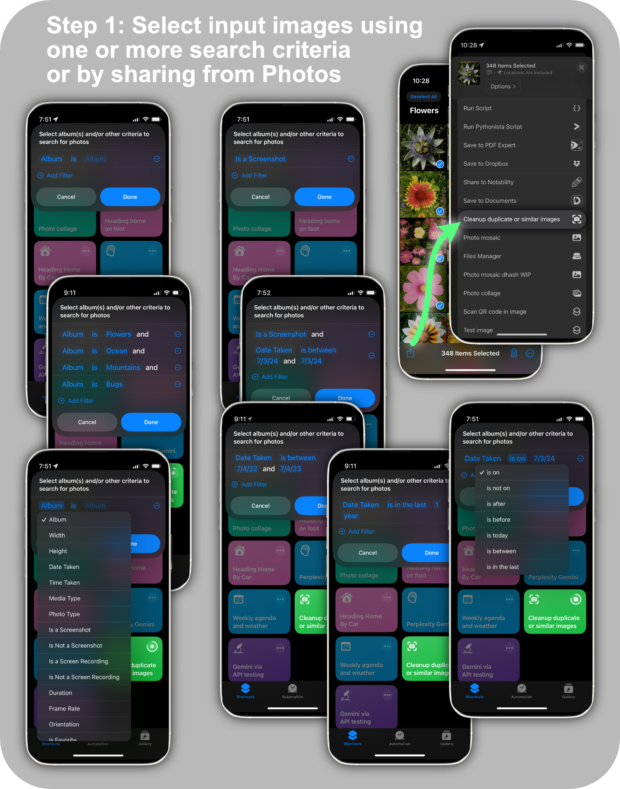
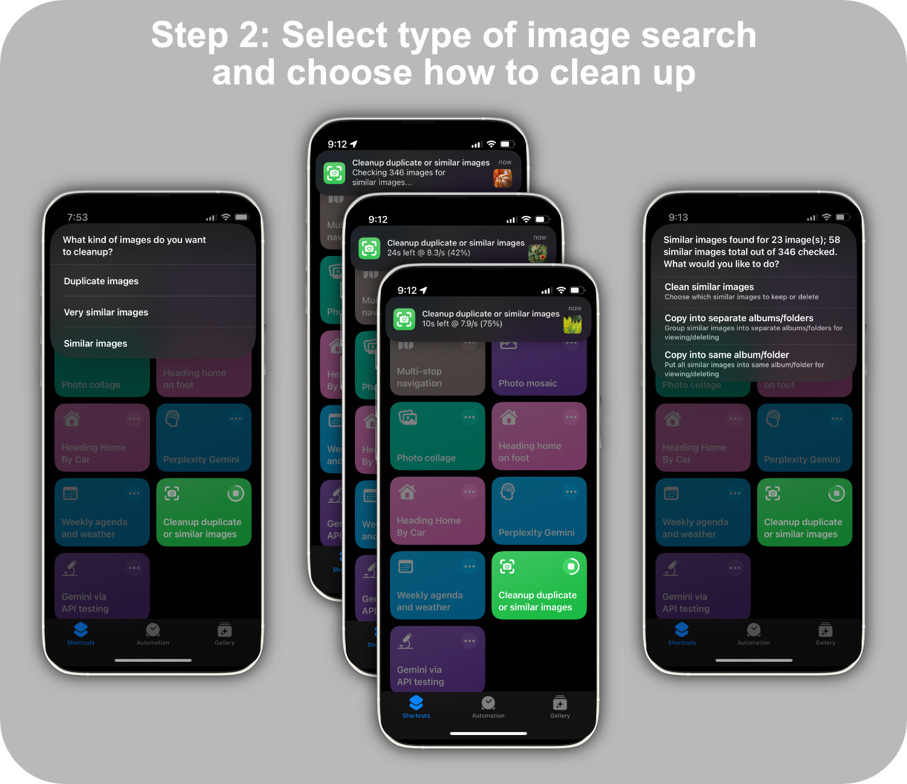
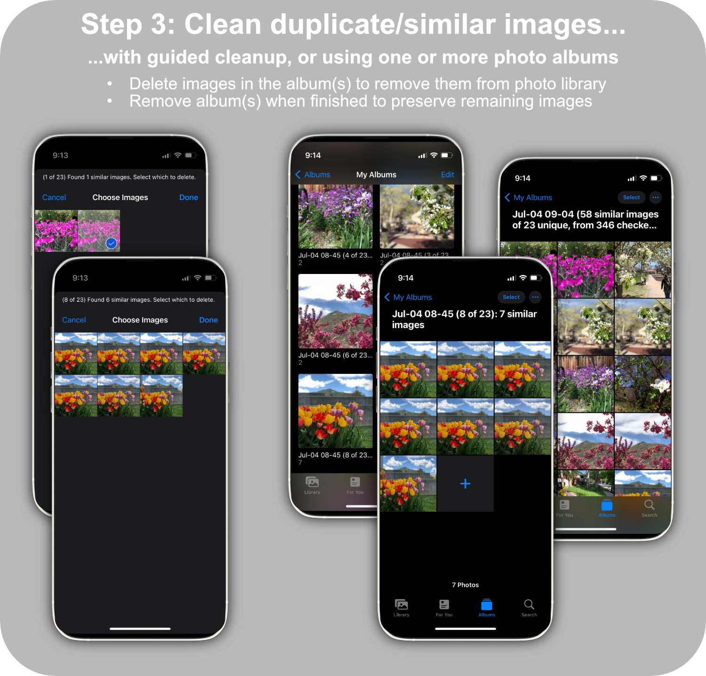
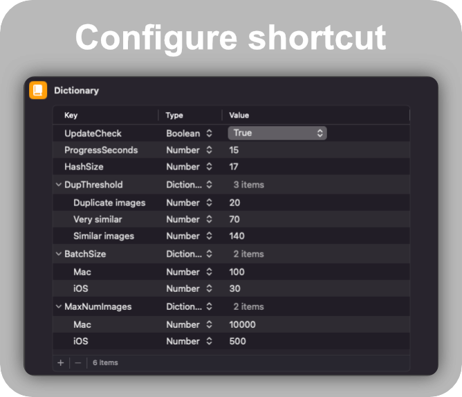

This shortcut uses [perceptual hashing](https://benhoyt.com/writings/duplicate-image-detection/) to quickly find duplicate or similar images in Photos or in Finder on a Mac.

Then it guides you through the cleanup process to remove duplicates, or organizes them into albums or folders so that you can review and delete duplicates easily.

