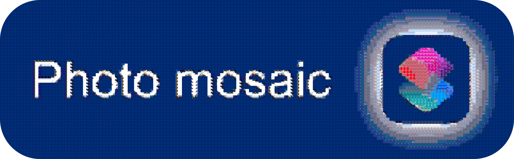

# Notes/Limitations

- 100% vanilla shortcut, utilizing build-in JavaScript support to perform advanced mosaic tile color matching
- If the shortcut crashes ("There was a problem running Photo mosaic"), try preprocessing mosaic tiles (step 2) to lower image size
- I won't tell you *how* to use this tool, but if you want my opinion, a good mosaic requires more than just a large tile library and a subject image. The subject image should have a good balance of colors and contrast, and should be a "good" image/photo; ideally something meaningful. Then the tile library should be able to reproduce the colors and contract of the subject image, but should also contextually match the subject image. For example, a mosaic of the moon made from images from NASA's Apollo missions, or from other space images. [Here's a blog post on what makes a good mosaic.](https://intellithoughts.wordpress.com/2011/03/08/photo-mosaic-tips/)

# Instructions

1. Collect a dozen or more images to use as a mosaic tile library. It takes hundreds of unique tiles to create a nice-looking mosaic, but you can get by with just a dozen or so thanks to the optional tile subdivision feature in step 2. You can store these in a photo album in the Photos app or optionally, for macOS users, in a folder on your computer.
2. Preprocess mosaic tiles. This step converts the images you collected in step 1 into smaller, square tiles. If your tile library is very small (fewer than 70-100 tiles), consider using the "stacked" subdivision option to create more unique tiles from the library you've prepared. When you're done, the preprocessed tiles will be saved to a new photo album or optionally, for macOS users, to a folder on your computer.
3. Specify subject image, mosasic grid size, tile-matching color space, and ***one or more tile libraries***. The subject image is the image you want to convert into a mosaic. The mosaic grid size is the number of tiles that will be used to represent the subject image. The tile-matching color space is the color space used to compare the colors of the subject image and the tiles in the library. The tile library is the photo album or folder containing the preprocessed tiles from step 2.
4. That's it! The mosaic will be created and you'll be prompted to view/save the result.

# Credits

- Used @atnbueno's [Autocrop Screenshot Stitcher](https://routinehub.co/shortcut/17347/) as inspiration for being able to perform pixel-level image analysis in JavaScript in a shortcut.

# Features

